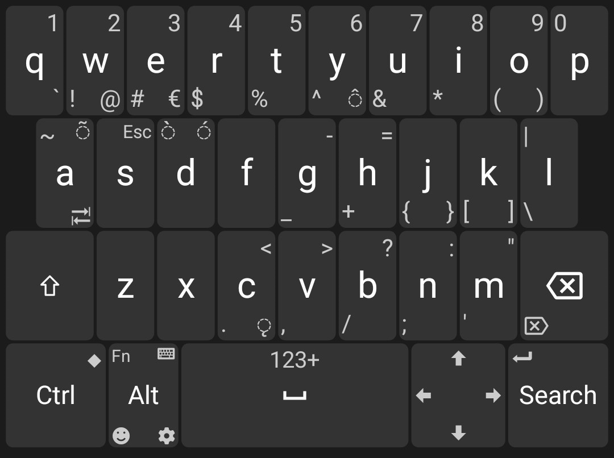

# Unexpected Keyboard
###  - Personal fork for testing and adding personal preferences - 
Awesome work on the original [upstream](https://github.com/Julow/Unexpected-Keyboard) repo

This fork currently has the following extra changes:
- Move corners extrakeys away from phone's edge (good for bulky phone case)
- Second click on CTRL or ALT locks their state ON

-----
A lightweight virtual keyboard for developers.

This app is a virtual keyboard for Android. The main features are easy typing of every ASCII character using the swipe gesture, dead keys for accents and modifier keys and the presence of special keys (tab, esc, arrows, etc..).

The keyboard shows up to 4 extra characters in the corners of each key. These extra characters are hit by swiping the finger on the key.

Highlight of some of the features:

- Every character and special keys that are also available on a PC keyboard. This is perfect for using applications like Termux.

- This includes Tab, Esc, the arrows and function keys, but also Ctrl and Alt !

- Accented keys are accessible using dead keys. First activate the accent, then type the accented letter.

- Very light and fast. Use 500x times less space than Google's keyboard and 15x times less than the default keyboard. No ad, no tracking.

- Multiple layouts: QWERTY, QWERTZ, AZERTY. Themes: White, Dark, OLED Black. And many other options.

Like any other virtual keyboards, it must be enabled in the system settings. Open the System Settings and go to:
System > Languages & input > On-screen keyboard > Manage on-screen keyboards.

## Contributing

For instructions on building the application, see
[Contributing](CONTRIBUTING.md).

## Screenshots

